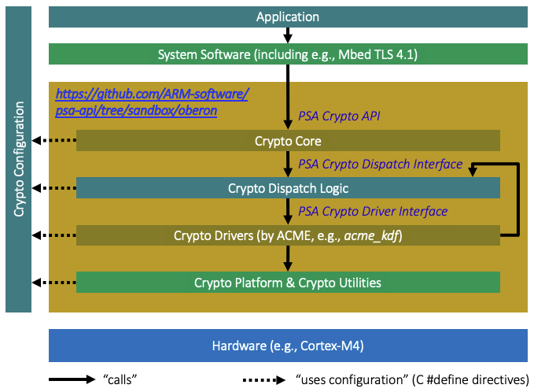

# README

## Summary

For implementers of a PSA Crypto Core or of a PSA Crypto Driver, this sandbox
provides early access to an up-to-date PSA Certified Crypto API implementation
that already supports the most advanced concepts of the emerging
PSA Crypto Driver Interface standard.
It thus gives a head start to anyone interested in, or actively involved in, the
standardization effort. This implementation of the PSA Certified Crypto API is
open source and comes with several software PSA Crypto Drivers as examples, along
with example configuration and dispatch logic. The purpose of this sandbox is to
speed up the development of the new standard, and to enable effective discussions
in the community by contributing working code.

## The PSA Driver Interface Initiative

This document assumes that you know about the industry initiative to develop,
validate, and standardize the PSA Crypto Driver Interface, as a complementary
specification to the PSA Certified Crypto API.
Otherwise, please first consult the following references:

- [PSA Crypto Driver Interface (Scope and Plan)](https://github.com/ARM-software/psa-api/discussions/306)
- [PSA Crypto Driver Interface (Open Issues)](https://github.com/ARM-software/psa-api/issues?q=state%3Aopen%20label%3A%22Crypto%20Driver%22)
- [PSA Crypto Driver Interface (Draft Spec)](https://arm-software.github.io/psa-api/crypto-driver/1.0/111106-PSA_Certified_Crypto_Driver_Interface-1.0-alp.1.pdf)
- [PSA Certified APIs (PSA Spec Links)](https://arm-software.github.io/psa-api/)

## Disclaimer: Open Source Sandbox, not Open Source Project

The purpose for this repo branch is to facilitate the creation of standards that
make it possible for any PSA Crypto Core to work with any set of PSA Crypto
Drivers, including any combination of hardware and software drivers.

In other words, the goal is a mature "contract" between PSA cores and drivers.

Oberon microsystems uses this code for prototyping new driver interface features
and contributes it to the community as a sandbox for demonstration,
experimentation, and standardization purposes. It is NOT intended for use in
production systems; it is provided as is and without warranties.

There may be occasional updates, time and resources permitting, but don't be
disappointed if it doesn't happen.

Everyone is free to use this code, according to its Apache 2.0 license.

No pull requests will be accepted.

The starting point for this software was Arm's TF-PSA-Crypto (or rather, the
code within Mbed TLS before the two were split into different repos) and
Oberon microsystems' derivative thereof. The software is a subset of the
commercial product
[Oberon PSA Crypto](https://www.oberon.ch/products/oberon-psa-crypto/).

Currently, the main topics of interest where this sandbox should be helpful are:

- Revised KDF driver interface
  [Issue 340](https://github.com/ARM-software/psa-api/issues/340):
  This implementation is a proof of concept that shows that the new interface
  works for transparent and opaque drivers.

- Revised PAKE driver interface
  [Issue 342](https://github.com/ARM-software/psa-api/issues/342):
  This implementation shows the revised PAKE API (since PSA Crypto API 1.3) and
  corresponding driver interface for EC-JPAKE, SPAKE2+, and even SRP and WPA3. It
  was tested with Oberon's commercial drivers (which are not part of this repo).

- Parameter validation responsibilities
  [Issue 332](https://github.com/ARM-software/psa-api/issues/332):
  Division of responsibilities between core, dispatch logic, and drivers.

- Optional overhead reduction, especially in the core, for key managemement. In
  particular, for bootloaders that use built-in keys.

- Some hardware architectures hide crypto keys but do not constitute feature-
  complete secure enclaves. Other hardware architectures implement complete
  secure enclaves, but do not yet support post-quantum (PQC) algorithms. In both
  cases, some crypto processing needs to be added outside of the
  hardware-protected environment. This requires some form of "semi-opaque"
  drivers.

- Some additional interfaces that a driver can use to make their development
  easier, or to make their code more secure or more portable.

- A software driver should be able to delegate some of its processing to a
  hardware driver in a systematic way. This is called driver chaining.
  The provided ACME drivers demonstrate driver chaining.

### Architecture of PSA Crypto

Figure 1 shows an architecture overview of this PSA Crypto sandbox
implementation. The "Certified" in "PSA Certified Crypto API", and the "PSA" in
the component names, are omitted for brevity.

All path names mentioned below are relative to the root of this sandbox.

### Application

Applications are clients of PSA Crypto, typically developed by device vendors.
This sandbox provides some tests in `tests/basic` that serve as simplified
proof-of-concept applications.

### System Software

System software includes clients like network stacks, e.g., Arm's Mbed TLS or a
Matter stack provided through a chip vendor's SDK.
This sandbox does not contain any system software.

### PSA Crypto Core

The PSA Crypto Core provides the platform-independent high-level interface for
clients.

The core itself is platform-independent and located in the following directories:

- `include` (header files)
- `core` (complete implementation, same code as in commercial Oberon PSA Crypto)

The core exposes the
[PSA Certified Crypto API 1.4.1](https://arm-software.github.io/psa-api/crypto/1.4/IHI0086-PSA_Certified_Crypto_API-1.4.1.pdf).

The core uses the PSA Crypto Dispatch Interface.

Assuming the availability of corresponding drivers, the core supports

- hashing (e.g., SHA2, SHA3, SHAKE)
- ciphers with and without AEAD (e.g., AES-CTR, AES-GCM, Ascon-AEAD128)
- message authentication codes (MAC, e.g., HMAC, KMAC, AES-CMAC)
- extendable output functions (XOF, e.g., SHAKE128, Ascon-XOF128)
- key derivation (KDF, e.g., HKDF, PBKDF2)
- password-authenticated key exchange (PAKE, e.g., EC-JPAKE, SPAKE2+, SRP, WPA3-SAE)
- key agreement (e.g., ECDH with P-256)
- key encapsulation (KEM, e.g., ML-KEM)
- digital signatures (e.g., ML-DSA)
- AES Key Wrap

This core does not support interruptible functions.

### PSA Crypto Dispatch Logic

The PSA Dispatch Logic (formerly called Driver Wrappers) is a configuration-
dependent adapter that connects the platform-independent core with a set of
potentially platform-specific drivers. Some or all drivers may depend on
specific crypto hardware. In this sandbox branch, a set of drivers is provided
from a ficticious company ACME. The drivers are functional software crypto
implementations but only intended for demonstration purposes.

The proof-of-concept dispatch logic is located in the following directories:

- `dispatch` (header files representing the dispatch interface)
- `targets/acme/poc/dispatch/psa` (header files defining operation contexts specific to the ACME drivers)
- `targets/acme/poc/dispatch` (example implementation of dispatch logic for demonstration purposes)

The dispatch logic exposes the platform-independent PSA Crypto Dispatch Interface.

The dispatch logic uses the PSA Crypto Driver Interface.

The dispatch logic supports the `acme` demonstration drivers (see below).

In particular, this proof-of-concept dispatch logic implementation demonstrates
dispatching to SHA, AES, HMAC, and KDF drivers. It sketches how to support the
new PAKE and XOF driver interfaces and demonstrates driver chaining, e.g., KDF
chains to HMAC, which in turn chains to SHA.

Note that core and dispatch logic eliminate code that is unnecessary for a given
configuration by using `# ifdefs` based on `PSA_WANT_XXX` directives defined for
example in the crypto configuration file
`targets/acme/poc/dispatch/psa/crypto_config.h`.

Dispatch logic follows systematic design patterns and naming rules, and can be
adapted as needed for the target hardware.

### PSA Crypto Drivers by ACME

The provided ACME Drivers are intended for proof-of-concept purposes, to make it
possible to build and run this software. However, these drivers are NOT intended
for use in production!

The ACME drivers are located in the following directory:

- `drivers/acme` (header files and implementation)

The ACME drivers expose the PSA Crypto Driver Interface.

The ACME drivers have no dependencies except for the `clib` and a `rand()`
function.

The following drivers are provided:

- `acme_sha` (SHA1, SHA224, SHA256)
- `acme_aes` (128-bit AES with CTR and CCM_STAR_NO_TAG modes)
- `acme_mac` (HMAC)
- `acme_kdf` (HKDF)
- `acme_rng` (assumes a `rand()` function from a TRNG)

The ACME KDF driver demonstrates Oberon's proposal to delay the calls from the
core to a KDF driver - and to buffer arguments passed through the "upper"
PSA Crypto API in the core - until the driver location can be determined and the
buffered arguments can be passed to it. This avoids unnecessary buffering,
unbounded buffer sizes, and the breaking of the high-level PSA Crypto API.

### PSA Crypto Utilities

PSA Crypto Utilities is a helper component that provides useful and portable
functions, e.g., for ASN1 parsing or constant-time comparison operations.

The utilities are located in the following directory:

- `utilities` (header files and implementation)

The files are copies from TF-PSA-Crypto 4.1.

### PSA Crypto Platform

PSA Crypto Platform is a helper component for the underlying system software
(if any) with a portable interface, e.g., regarding memory allocation and
multi-threading.

The platform is located in the following directory:

- `platform` (header files and implementation)

The files are copies from TF-PSA-Crypto 4.1, with minor modifications.

### PSA Crypto Configuration

The PSA Crypto Configuration is a build-time configuration that, through the
definition of C `#define` directives, determines which crypto features will be
included in the built firmware images.

The `#define PSA_WANT_<xxx>` directives define what the application "wants" — the
algorithms, key types, and key sizes that an application uses. This allows to
avoid the inclusion of unnecessary drivers, or even of unnecessary code within
drivers or within the platform component.

The `#define PSA_USE_<xxx>` directives select which drivers to include, as there
may be multiple candidates available for the same cryptographic feature.

## Compatibility with Mbed TLS 4.1

[Mbed TLS 4.1](https://github.com/Mbed-TLS/mbedtls/releases/tag/mbedtls-4.1.0)
may still have some dependencies on Mbed TLS legacy interfaces, although most of
the functionality now depends on the PSA Crypto API only and is therefore
compatible with this sandbox. It is expected that future versions of Mbed TLS
will further reduce edge case incompatibilities.

## Getting Started

This sandbox implementation of PSA Crypto can be built on a Linux or macOS
host with CMake.

For testing and as application examples, the sandbox comes with some basic tests
for SHA 256, HMAC, HKDF, and AES-128.

### Prerequisites

CMake version 3.13 or newer.

### Build on Linux / macOS

Build the source in a separate directory `build` from the command line:

    cd /path/to/this/repo
    cmake -B build
    cmake --build build

This builds the crypto configuration defined in `targets/acme/poc/dispatch`
and the basic tests located in `tests/basic`.

Multi-threading support can be switched on using the `CONFIG_MBEDTLS_THREADING`
option:

    cmake -B build -DCONFIG_MBEDTLS_THREADING=ON

### Test on Linux / macOS

Tests can be executed from the command line:

    cd build
    ctest -C Debug

## Disclaimer

This software and documentation is distributed on an "AS IS" BASIS, WITHOUT
WARRANTIES OR CONDITIONS OF ANY KIND, either express or implied.

This file by Oberon microsystems AG is licensed under the
[Creative Commons Attribution-ShareAlike 4.0 License](https://creativecommons.org/licenses/by-sa/4.0/).
