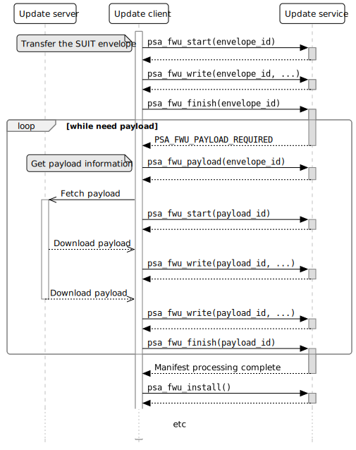

.. SPDX-FileCopyrightText: Copyright 2024 Arm Limited and/or its affiliates <open-source-office@arm.com>
.. SPDX-License-Identifier: CC-BY-SA-4.0 AND LicenseRef-Patent-license

Support for SUIT in the Firmware Update API
===========================================

SUIT is a suite of emerging specifications from the Software Updates for Internet of Things IETF working group.

SUIT defines a 'manifest' to describe the meta-data about a firmware update, and an 'envelope' that contains a signed manifest, and 'payloads' that can be integrated within the envelope, or detached from the envelope and delivered separately. SUIT supports Secure update and Secure boot policies. A SUIT manifest contains sequences of commands for various stages of the update process, for example:

* Determine the compatibility of the update for the device
* Evaluate the set of firmware payloads that are required
* Fetch and verify the payloads
* Install the updated firmware
* Verify, load and execute the firmware when booting the device

Processing the commands requires a small interpreter in the target device.

SUIT also supports the composition of manifests, to support various more complex use cases. In these cases, one or more of the components described by the dependent manifest are themselves a dependency SUIT manifest.

Further information about SUIT:

*  SUIT architecture (RFC 9019): https://datatracker.ietf.org/doc/rfc9019/
*  Manifest information model (RFC 9124): https://datatracker.ietf.org/doc/rfc9124/
*  CBOR-based format for a SUIT manifest (draft RFC): https://datatracker.ietf.org/doc/draft-ietf-suit-manifest/
*  Nested/Dependency SUIT manifests (draft RFC): https://datatracker.ietf.org/doc/draft-ietf-suit-trust-domains/
*  SUIT paper: https://hal.inria.fr/hal-02351794/document
*  IETF working group: https://datatracker.ietf.org/wg/suit/about/

In the Firmware Update API v1.0 specification, `§2.7 Firmware format independence <https://arm-software.github.io/psa-api/fwu/1.0/overview/goals.html#firmware-format-independence>`_ states:

   New standards for firmware update within IoT are being developed, such as A Firmware Update Architecture for Internet of Things (RFC9019).

   This version of the Firmware Update API is suitable for some of the use cases that are defined by A Manifest Information Model for Firmware Updates in Internet of Things (IoT) Devices (RFC9124) and A Concise Binary Object Representation (CBOR)-based Serialization Format for the Software Updates for Internet of Things (SUIT) Manifest (SUIT-MFST). For example, where the payloads are integrated in the manifest envelope, or there is just one external payload to the envelope.

   Support for the more complex use cases from (RFC9124), with multiple external payloads, is not considered in version 1.0 of the Firmware Update API, but might be in scope for future versions of the interface.

Analysis
--------

The v1.0 API is designed to support update processes where an entity on the Update client side of the API makes the decisions about which firmware images need to be downloaded and transferred to the Update service, prior to the Update service checking that the update is valid, and verifying and installing the images. This orchestrating entity might be within the device (e.g. the Update client), or within the network (e.g. the Update server).

In SUIT, the decisions regarding which images to install is based on the command sequences in the manifest. For a Secure firmware update, the command processing ideally takes place within the trusted execution environment - typically this would be part of the Update service.

If the payloads (firmware images) in a SUIT update are detached, then the SUIT processor is expected to fetch these from a URI specified within the SUIT envelope. However, the v1.0 API does not provide a mechanism for the Update service to request additional payloads (firmware images) that need to be downloaded.

One solution would be to process the SUIT manifest initially in the Update client, in order to identify, download, and transfer any additional payloads. Then, the manifest is processed a second time in the Update service to validate the decisions made by an untrusted Update client, and verify the payloads. This approach would require additions to the API to provide attributes relating to the currently installed firmware, that are required by the SUIT processing in the Update client.

An alternative solution is to process the SUIT manifest in the Update service, and add functionality to the API that allows the Update service to request that the Update client download and transfer additional payloads.

In either case, additional processing of the SUIT manifest will occur at boot time when authenticating, loading and executing the firmware.

One of the design objectives for the Firmware Update API is to separate the concerns for the Update client and Update service:

*  In the first solution, the Update client is required to know the manifest format, and be able to process it.
*  In the second solution, the Update client is only required to know how to handle a firmware component that is a manifest, and which might request additional firmware images to be provided.

There might be additional benefits to designing the API around the second approach. SUIT does not constrain the use of the payload fetch command to the command sequences used to obtain and validate an update: it is permitted for the install command sequence to also fetch additional payloads. For more complex devices, there are some use cases for this:

*  If the full firmware update does not fit into available storage, prior to installation. The firmware must be transferred and written to the installation location incrementally. Note that this prevents the device being able to rollback an update - however, if the system has an installer application that can fetch such payloads, this can also act as a device recovery procedure when an update fails.
*  If the payload contains secrets that should not be transferred or stored by untrusted application firmware.

Proposal
--------

This proposal is based around the second approach in the analysis: the initial processing of the SUIT manifest is performed by the Update service, and the Update client does not require any knowledge of the encoding or format of the data that it transfers to the Update service. This approach enables the API design, and Update client implementation, to work with other SUIT-like architectures, or with alternative encodings of the SUIT manifest. It also makes it possible to reuse the same API for interaction between a payload fetcher and a trusted installer that runs as part of a dedicated Installer application.

Alignment with the v1.0 API
~~~~~~~~~~~~~~~~~~~~~~~~~~~

Handling the SUIT envelope
^^^^^^^^^^^^^^^^^^^^^^^^^^

The Firmware Update API 1.0 includes a ``manifest`` parameter in the ``psa_fwu_start()`` function, which allows an Update client to provide detached metadata for the firmware image. However, this is not suitable for use with SUIT:

*  The SUIT manifest is embedded within the SUIT 'envelope', and each envelope can contain any number of integrated and detached 'payloads'.
*  The SUIT envelope can be very large, containing multiple integrated payloads. The ``manifest`` parameter must be passed in the single call to ``psa_fwu_start()``.

Instead, we should choose one of the following approaches:

1. A SUIT envelope is treated as a 'firmware component'. The Update service developer allocates a component identifier for each top-level SUIT envelope (as they would for each firmware component if SUIT is not being used). This allows the envelope to be transferred in multiple calls to ``psa_fwu_write()``, if required, and allows it to be associated with any number of additional payload images.

2. As the later handling of an envelope-type component will necessarily be different from non-envelope components, we could use a new API to specify that an envelope is being transferred. For example, ``psa_fwu_start_envelope(envelope_id)`` - which would then be followed by calls to ``psa_fwu_write()`` and ``psa_fwu_finish()`` to transfer the envelope data.

If a device supports only a single top-level SUIT envelope, then the identifier could just be a default value (0?).

The implementation will need to have some storage for the entire envelope during processing. The envelope, or a trimmed-down copy, should be persistently retained for boot processing. To support rollback of a failed installation, or resumption of an interrupted update (e.g. device restart while processing the payload fetching), the full envelope may need to be stored by the implementation in non-volatile staging memory.

Triggering SUIT processing
^^^^^^^^^^^^^^^^^^^^^^^^^^

The SUIT envelope is processed once it has been transferred in its entirety (note that the Firmware Update API permits out-of-order transfer of the data for a component). At this stage, the SUIT processing consists of:

1. Verify the authenticity of the SUIT manifest, using the signature within the envelope. The manifest in turn contains data and commands that can verify the integrity of data that is outside of the manifest, including the integrated and detached payloads.
2. Validating the compatibility of the SUIT update with the device, and its current firmware.
3. Determining which firmware images require update, and fetching the required payloads.
4. Verifying the payloads that will be installed.

This could fit naturally as part of ``psa_fwu_finish()``, called when the envelope component has been fully transferred. Alternatively, to distinguish a call to the API that might trigger complex processing, including requests for more images, it might be beneficial to define a new API for this step.

Processing the suit-install command sequence would occur after the Update client has called ``psa_fwu_install()``. This might occur within an Installer or Bootloader component, following a reboot, or immediately as part of the call to ``psa_fwu_install()``.

Transferring payloads
^^^^^^^^^^^^^^^^^^^^^

The API requires functions to report information to the Update client to enable a payload to be identified and obtained, and then transferred to the Update service.

The existing functions for transferring firmware images can be used for each additional payload that is requested during SUIT manifest processing. Additional API is needed to return payload identification (e.g. URI), and a firmware component id to use for the transfer.

Some consideration is needed for allocating component identifiers for the additional payloads. As a location, or identifier, for firmware image being requested is provided by the Update service, the component identifier used for this transfer does have to be pre-allocated by the firmware developer - as is required for current firmware components, or top-level envelope components.

Initiating installation
^^^^^^^^^^^^^^^^^^^^^^^

The current API already requires that the Update client calls ``psa_fwu_install()`` to stage any CANDIDATE components for update. This enables multiple components to be installed concurrently, and prevents an unplanned restart to cause unexpected firmware installation.

This fits well with the need to complete the transfer and processing of the SUIT envelope, and transfer all requested payloads, prior to initiating their installation.

Recovery after interruption
^^^^^^^^^^^^^^^^^^^^^^^^^^^

An envelope component that has been downloaded, but which has not completed SUIT processing, should present a new status in response to a call to ``psa_fwu_query()``, that enables the Update client to detect that SUIT processing is required. This can enable an implementations to support restarting the update that was interrupted.


State-based design
~~~~~~~~~~~~~~~~~~

A high level flow for the initial update process is shown in `Figure 1 <fig-update-flow_>`_.

.. figure:: suit-update.svg
   :name: fig-update-flow

   **Figure 1** *The initial flow in a SUIT update*

*Note:*
   This flow only shows a standard flow that requires a reboot to complete installation, and that does not encounter an error condition, or suffer from an interrupting device restart while processing the envelope.

   The state model and API design must permit an implementation to recover from an interruption, without needing to discard all of the data that has already been transferred.

This proposal is focussed on the changes required to the Firmware Update API - both the programming model and the C interfaces - that are required to enable this update flow. The aim is to make the API independent of the choices made in the implementation of the API, e.g. with regards to firmware storage, or subsequent SUIT processing steps.

The overall process in `Figure 1 <fig-update-flow_>`_ will be managed as follows:

*  Extending the v1.0 state model within the Firmware Update API to include component states for envelope processing.
*  Providing an interface to indicate that envelope processing is required.
*  Providing an interface to indicate the need for an additional payload image, and provide details of the payload, so it can be downloaded and transferred.
*  Defining the behavior when a partially complete SUIT update fails, is aborted by the client, or an unexpected restart occurs in one of the new states.

*Note:*
   Although it looks tempting to use callbacks in the API to implement the payload fetching operation, this has a number of challenges:

   *  The Update client thread/task would have to block while obtaining the requested payload (which can be split into multiple data transfers), and only return from the callback when complete.
   *  It requires the Update service to be re-entrant, when transferring the requested payload to the service.
   *  On deployments where the Update service is isolated from the Update client, the callback mechanism will only operate in the client, and still require a state-based approach within the service.

   Therefore, a callback-based API would not be usable in many systems. In order to define a single API for this feature that can be used in all types of system execution environment, the chosen approach for fetching payloads is to use a return value from manifest processing that signals the need for the application to fetch and transfer a payload before resuming the SUIT manifest processing.

Complex installation sequences
^^^^^^^^^^^^^^^^^^^^^^^^^^^^^^

Where a SUIT manifest includes additional payload fetching as part of the suit-install command sequence, the manifest processing and payload fetching cycle would be repeated after the installation commences. This might occur immediately if no reboot is required, or as part of a dedicated Bootloader/Installer state of the system if this requires a system restart.

`Figure 2 <fig-install-flow_>`_ shows an example of the additional flow when fetching during installation after a reboot.

.. figure:: suit-install.svg
   :name: fig-install-flow

   **Figure 2** *The additional flow in a complex SUIT installation*


Draft API design
~~~~~~~~~~~~~~~~

*Note that this is a draft proposal, and selects one from a number of similar options. This seems to be a good fit with the specific behavior of nested manifests in SUIT, but could also work with other manifest architectures. The naming of any new API identifiers is also subject to discussion and revision.*

`Figure 3 <fig-fetch_>`_ shows the detailed call sequence for the Update client when initially processing a SUIT envelope



   **Figure 3** *The normal call sequence for initial SUIT update*

   This shows the transfer of the envelope, and the processing of the suit-payload-fetch command sequence.

The detailed steps of the flow are as follows (the numbers refer to the corresponding number in Figure 2):

1. The process is started by transferring the SUIT envelope as a firmware image using a component identifier allocated to the SUIT envelope component.

6. The call to ``psa_fwu_finish()`` behaves differently when processing a SUIT envelope. On a successful transfer, the call will return a new response code, ``PSA_FWU_PROCESSING_REQUIRED``, to indicate that the component requires processing. At this point the envelope component will be in a new ``PSA_FWU_PROCESSING`` state, instead of the typical ``PSA_FWU_CANDIDATE`` state.

7. If processing is required, the Update client then calls ``psa_fwu_process()`` on the Envelope component to begin manifest processing. At this point the Update service will do the following:

   * Verify and authenticate the manifest.
   * Process the Update command sequences: system validation, dependency resolution, payload fetch, payload verification.

8. If a payload is required that is detached from the Envelope, the call to ``psa_fwu_process()`` returns with a new status code, ``PSA_FWU_PAYLOAD_REQUIRED``, and the Envelope component will be in a new state, ```PSA_FWU_FETCHING``. The call to ``psa_fwu_process()`` includes an output parameter, which the service uses to provide the details of the payload to be transferred, including a component identifier (for use with ``psa_fwu_start()`` etc), and a URI for the payload.

   The Update service might also have information about the size and digest of the payload to be fetched. These could be optionally be provided with the payload URI: are there benefits in using this information to eliminate or detect incorrect or malicious transfers prior to transfer to the Update service?

   *Note:*
      It is not clear that the FETCHING state is required, as distinct from PROCESSING, although it can make it clearer which calls are valid on the Envelope component. I expect that this state will be volatile, as resuming a partially transferred payload after a restart has the same complexity as resuming a component transfer that is in WRITING state - this behavior currently requires additional non-standard API for the Update client and service.

9. The Update client must now fetch the payload, using the URI to locate it, and transfer it to the Update service using the standard ``psa_fwu_start()``, ``psa_fwu_write()`` and ``psa_fwu_finish()`` calls, providing the component identifier returned in the payload information.

19. When ``psa_fwu_finish()`` is called, the payload component enters CANDIDATE state: the normal behavior for components when ``psa_fwu_finish()`` is called. In addition, the envelope component returns to PROCESSING state.

20. As the Update client is in the middle of processing an envelope component, it calls ``psa_fwu_process()`` on the envelope component once more. The Update service resumes the SUIT manifest processing from where it halted when fetching the payload. If another payload is required, then ``PSA_FWU_PAYLOAD_REQUIRED`` is returned from the call to ``psa_fwu_process()``, and processing continues from step (8) above.

21. When the Update service completes the processing this phase of the SUIT manifest commands, the Envelope component is moved to the CANDIDATE state, and the last call to ``psa_fwu_process()`` returns ``PSA_SUCCESS``.

22. To proceed with the installation, the Update client now calls ``psa_fwu_install()``.

23. The flow in Figure 3 shows a system which requires a reboot to continue with the installation. The suit-install SUIT command sequences will be processed after the reboot.

    In systems where the installation of the envelope component is achieved without a restart, the installation command sequence will be executed as part of the call to ``psa_fwu_install()``, and complete the installation.

    *Todo:*
      If this sequence contains additional payload fetch commands, then we could permit ``psa_fwu_install()`` to put the component into PROCESSING state, and require the Update client to use ``psa_fwu_process()``, and then transfer any new payloads? - an issue is that ``psa_fwu_install()`` acts on *all* candidates, but ``psa_fwu_process()`` (as currently proposed) acts on a specific envelope.

*Note:*
   In systems where the installation occurs following reboot, or in a special execution state of the system, the implementation might choose to use the Firmware Update API between a trusted installer agent and a payload fetcher agent. Although the interfaces used for this can be implementation-defined, `Figure 4 <fig-installer_>`_ is an example of how this could be done using the Firmware Update API.

   .. figure:: install-api-sequence.svg
      :name: fig-installer

      **Figure 4** *Example use of the Firmware Update API for a dedicated Installer state*

      This shows the operation of the Installer and Payload fetcher following a reboot with a STAGED envelope.

Errors
^^^^^^

If at any stage during SUIT processing, the Update service encounters an error, the relevant component or components will be put into the FAILED state, and the Update client will need to use ``psa_fwu_clean()`` as usual to restore the initial firmware state.

Dependency manifests
^^^^^^^^^^^^^^^^^^^^

In SUIT, a dependency manifest (one nested within a dependent manifest) is not processed in an isolated manner. Instead, all dependency manifests, including those nested at deeper levels, are identified and fetched before any other payload. Then the full set of manifests is involved in each of the subsequent command processing stages of the SUIT top-level (root) manifest.

The invocation of commands sequences within dependency manifests is governed by the command sequences within the dependent manifest, rather than by an architecturally defined process within SUIT.

In the proposed API, this is transparent to the Update client. When processing the root manifest, all of the detached manifest payloads will be requested from the Update client first, and the non-manifest component payloads after that. There is no difference in the Update client operation, these are just payloads being transferred to the Update service.

Aborting an update
^^^^^^^^^^^^^^^^^^

If the Update client chooses to abandon an update, when the envelope component is in PROCESSING, FETCHING, or CANDIDATE state - it can use ``psa_fwu_cancel()``, as for the v1.0 API for components before ``psa_fwu_install()`` is called. In the case of an envelope component, this will also call any associated payloads to be discarded as well, whether the payloads are in WRITING or CANDIDATE state.

*Rationale:*
   This is because the payload components do not have a top-level component identifier that is well known to the Update client, and the client is not expected to track the payload identifiers that have been requested by the ``psa_fwu_process()`` calls.

An Update client can call ``psa_fwu_cancel()`` + ``psa_fwu_clean()`` on a payload component currently being transferred (steps 8 - 20), and restart the transfer of that component with ``psa_fwu_start()``. This is not permitted on payloads which have been fully transferred.

Cancelling the payload transfer isn't required to abort the entire update. The Update service will have to be able to discard any already, or partially, transferred payloads based on the envelope identifier.

Restarting an update
^^^^^^^^^^^^^^^^^^^^

Following an interruption to the standard process, for example, a system restart while processing a manifest, or fetching a payload, the processing of SUIT commands can be restarted. This requires that the implementation retains envelopes and payloads that have already been transferred - i.e. the staging is not volatile for components in PROCESSING or CANDIDATE state.

Following a restart, the Update client should query the status of the envelope component. If this reports a state of ``PSA_FWU_PROCESSING``, this indicates to the Update client that it should call ``psa_fwu_process()`` to restart the SUIT manifest processing (at step (7) in the standard flow above).

*Note:*
   The implementation will have to re-verify the manifest, and process the command sequences from the beginning. The service can avoid requesting payload images which where previously transferred, and match the payload digest.

Component identifiers
^^^^^^^^^^^^^^^^^^^^^

Each top-level envelope must have an allocated Firmware Update API component id. This is used to query status and transfer new SUIT envelopes for update.

To reuse the image transfer APIs for SUIT payloads, a payload component id is required. These component identifiers are not valid for status queries outside of the payload fetch operation. Querying them during the payload fetch might be a useful feature to retain?

The allocation of the payload identifiers is implementation defined:

*  They can be allocated statically by the firmware developer
*  They can be allocated dynamically by the implementation
*  They can be reused during the course of the SUIT processing as the API only permits a single payload to be transferred at a time

*Todo*
   It might be beneficial to define a larger integral type as the component identifier.

   Would this break compatibility for the API?

Detailed API definition
~~~~~~~~~~~~~~~~~~~~~~~

*TBD*

Open Issues
-----------

*  Detailed API design.
*  Final naming of API elements.
*  The current ``psa_fwu_component_id_t`` is typed as a 8-bit integer. Is that sufficient for this API, or should we allocate a larger size for this type?
*  Are there additional attributes for components that need to be included in the ``psa_fwu_component_info_t``?
*  Do we need a separate FETCHING state for the envelope? - it clarifies the behavior of the API calls, but is never valuable as a persistent state, as it does not assist with restarting after interruption, or with aborting or cleaning up after error.
*  If we want to permit payload fetching as part of the call to ``psa_fwu_install()``, we need to determine how to handle component ids:

   1. We could expect that the client queries the status of the top-level envelopes to determine which ones need to be processed after ``psa_fwu-install()`` returns ``PSA_FWU_PROCESSING_REQUIRED``. This is the behaviour required on restart, or by a dedicated payload fetcher.
   2. We could limit API to a single top-level envelope installation at a time, and remove the component id from ``psa_fwu_process()``.
   3. We could introduce a separate API for SUIT processing of the install sequences, that does not use a component id; or we could have the envelope id be unused for this stage of processing. The implementation would have to work out which envelopes need processing.
   4. We could remove component id from ``psa_fwu_process()``, and have implementation figure out which envelope needs to be processed whenever it is called.

Revision history
----------------

03/04/2024
   Second update:

   * Added flows to show the use of the API for fetching during the installation sequence. The state model and API mostly works for this, but a open issue around component id usage remains.
   * Proposed a scheme for Firmware Update API component ids.

07/03/2023
   Major update following initial review:

   * Reworked the state model and API based on detailed understanding of the Multiple Trust Domain extension to the base SUIT specification.
   * Added component state information to the detailed sequence graphic to clarify the programming model.
   * Aligned the document with the details of the SUIT specifications.
   * Provided more detail on how the API design supports the alternative flow scenarios.

15/02/2023
   Initial draft proposal.
