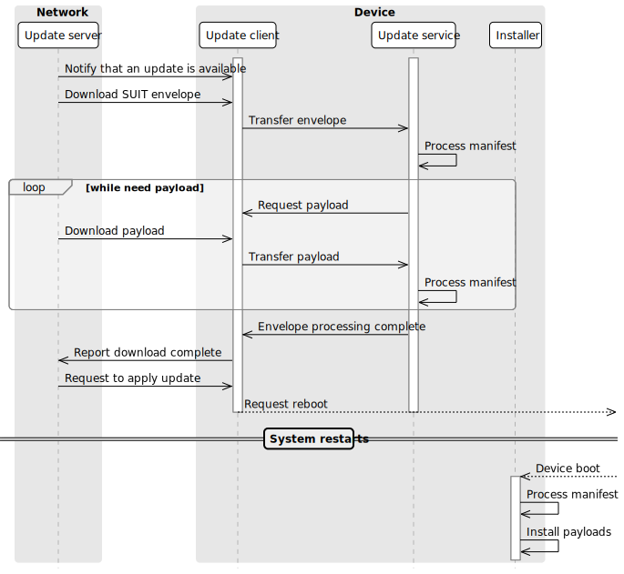
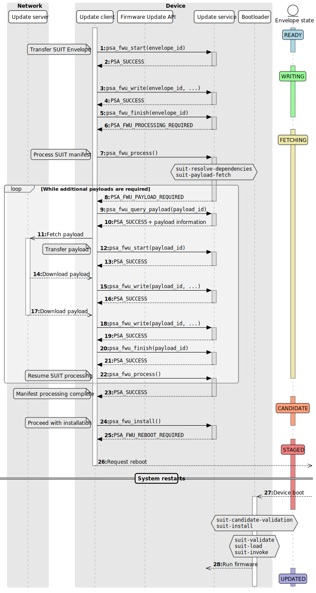
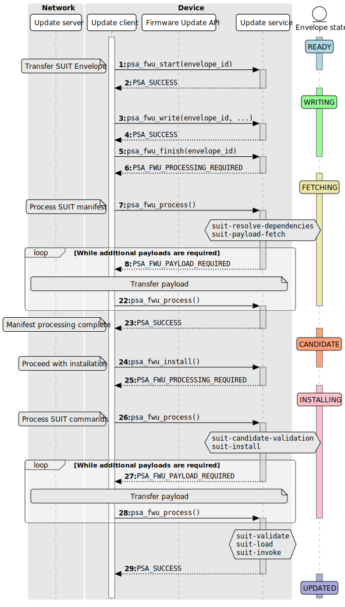
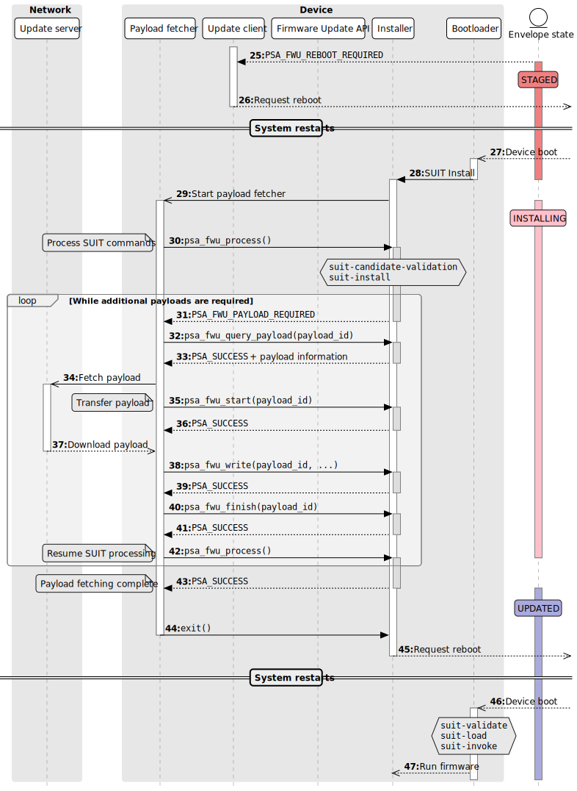

.. SPDX-FileCopyrightText: Copyright 2024 Arm Limited and/or its affiliates <open-source-office@arm.com>
.. SPDX-License-Identifier: CC-BY-SA-4.0 AND LicenseRef-Patent-license

Support for SUIT in the Firmware Update API
===========================================

**Contents**

*  `Use case`_
*  `Analysis`_
*  `Proposed design`_
*  `Draft API design`_
*  `Detailed API definition`_
*  `Open Issues`_
*  `Appendix - alternative API options`_
*  `Revision history`_

Use case
--------

SUIT is a suite of emerging specifications from the Software Updates for Internet of Things IETF working group.

SUIT defines a 'manifest' to describe the meta-data about a firmware update, and an 'envelope' that contains a signed manifest, and 'payloads' that can be integrated within the envelope, or detached from the envelope and delivered separately. SUIT supports Secure update and Secure boot policies. A SUIT manifest contains sequences of commands for various stages of the update process, for example:

* Determine the compatibility of the update for the device
* Evaluate the set of firmware payloads that are required
* Fetch and verify the payloads
* Install the updated firmware
* Verify, load and execute the firmware when booting the device

Processing the commands requires a small interpreter in the target device.

SUIT also supports the composition of manifests, to support various more complex use cases. In these cases, one or more of the components described by the dependent manifest are themselves a dependency SUIT manifest.

Further information about SUIT:

*  SUIT architecture (RFC 9019): https://datatracker.ietf.org/doc/rfc9019/
*  Manifest information model (RFC 9124): https://datatracker.ietf.org/doc/rfc9124/
*  CBOR-based format for a SUIT manifest (draft RFC): https://datatracker.ietf.org/doc/draft-ietf-suit-manifest/
*  Nested/Dependency SUIT manifests (draft RFC): https://datatracker.ietf.org/doc/draft-ietf-suit-trust-domains/
*  SUIT paper: https://hal.inria.fr/hal-02351794/document
*  IETF working group: https://datatracker.ietf.org/wg/suit/about/

In the Firmware Update API v1.0 specification, `§2.7 Firmware format independence <https://arm-software.github.io/psa-api/fwu/1.0/overview/goals.html#firmware-format-independence>`_ states:

   New standards for firmware update within IoT are being developed, such as A Firmware Update Architecture for Internet of Things (RFC9019).

   This version of the Firmware Update API is suitable for some of the use cases that are defined by A Manifest Information Model for Firmware Updates in Internet of Things (IoT) Devices (RFC9124) and A Concise Binary Object Representation (CBOR)-based Serialization Format for the Software Updates for Internet of Things (SUIT) Manifest (SUIT-MFST). For example, where the payloads are integrated in the manifest envelope, or there is just one external payload to the envelope.

   Support for the more complex use cases from (RFC9124), with multiple external payloads, is not considered in version 1.0 of the Firmware Update API, but might be in scope for future versions of the interface.

Analysis
--------

The v1.0 API is designed to support update processes where an entity on the Update client side of the API makes the decisions about which firmware images need to be downloaded and transferred to the Update service, prior to the Update service checking that the update is valid, and verifying and installing the images. This orchestrating entity might be within the device (e.g. the Update client), or within the network (e.g. the Update server).

In SUIT, the decisions regarding which images to install is based on the command sequences in the manifest. For a Secure firmware update, the command processing ideally takes place within the trusted execution environment - typically this would be part of the Update service.

If the payloads (firmware images) in a SUIT update are detached, then the SUIT processor is expected to fetch these from a URI specified within the SUIT envelope. However, the v1.0 API does not provide a mechanism for the Update service to request additional payloads (firmware images) that need to be downloaded.

One solution would be to process the SUIT manifest initially in the Update client, in order to identify, download, and transfer any additional payloads. Then, the manifest is processed a second time in the Update service to validate the decisions made by an untrusted Update client, and verify the payloads. This approach would require additions to the API to provide attributes relating to the currently installed firmware, that are required by the SUIT processing in the Update client.

An alternative solution is to process the SUIT manifest in the Update service, and add functionality to the API that allows the Update service to request that the Update client download and transfer additional payloads.

In either case, additional processing of the SUIT manifest will occur at boot time when authenticating, loading and executing the firmware.

One of the design objectives for the Firmware Update API is to separate the concerns for the Update client and Update service:

*  In the first solution, the Update client is required to know the manifest format, and be able to process it.
*  In the second solution, the Update client is only required to know how to handle a firmware component that is a manifest, and which might request additional firmware images to be provided.

There might be additional benefits to designing the API around the second approach. SUIT does not constrain the use of the payload fetch command to the command sequences used to obtain and validate an update: it is permitted for the install command sequence to also fetch additional payloads. For more complex devices, there are some use cases for this:

*  If the full firmware update does not fit into available storage, prior to installation. The firmware must be transferred and written to the installation location incrementally. Note that this prevents the device being able to rollback an update - however, if the system has an installer application that can fetch such payloads, this can also act as a device recovery procedure when an update fails.
*  If the payload contains secrets that should not be transferred or stored by untrusted application firmware.

Proposed design
---------------

This proposal is based around the second approach in the analysis: the initial processing of the SUIT manifest is performed by the Update service, and the Update client does not require any knowledge of the encoding or format of the data that it transfers to the Update service. This approach enables the API design, and Update client implementation, to work with other SUIT-like architectures, or with alternative encodings of the SUIT manifest. It also makes it possible to reuse the same API for interaction between a payload fetcher and a trusted installer that runs as part of a dedicated Installer application.

Alignment with the v1.0 API
~~~~~~~~~~~~~~~~~~~~~~~~~~~

Handling the SUIT envelope
^^^^^^^^^^^^^^^^^^^^^^^^^^

The Firmware Update API 1.0 includes a ``manifest`` parameter in the ``psa_fwu_start()`` function, which allows an Update client to provide detached metadata for the firmware image. However, this is not suitable for use with SUIT:

*  The SUIT manifest is embedded within the SUIT 'envelope', and each envelope can contain any number of integrated and detached 'payloads'.
*  The SUIT envelope can be very large, containing multiple integrated payloads. The ``manifest`` parameter must be passed in the single call to ``psa_fwu_start()``.

Instead, we should choose one of the following approaches:

1. A SUIT envelope is treated as a 'firmware component'. The Update service developer allocates a component identifier for each top-level SUIT envelope (as they would for each firmware component if SUIT is not being used). This allows the envelope to be transferred in multiple calls to ``psa_fwu_write()``, if required, and allows it to be associated with any number of additional payload images.

2. As the later handling of an envelope-type component will necessarily be different from non-envelope components, we could use a new API to specify that an envelope is being transferred. For example, ``psa_fwu_start_envelope(envelope_id)`` - which would then be followed by calls to ``psa_fwu_write()`` and ``psa_fwu_finish()`` to transfer the envelope data.

If a device supports only a single top-level SUIT envelope, then the identifier could just be a default value (0?).

The implementation will need to have some storage for the entire envelope during processing. The envelope, or a trimmed-down copy, should be persistently retained for boot processing. To support rollback of a failed installation, or resumption of an interrupted update (e.g. device restart while processing the payload fetching), the full envelope may need to be stored by the implementation in non-volatile staging memory.

Triggering SUIT processing
^^^^^^^^^^^^^^^^^^^^^^^^^^

The SUIT envelope is processed once it has been transferred in its entirety (note that the Firmware Update API permits out-of-order transfer of the data for a component). At this stage, the SUIT processing consists of:

1. Verify the authenticity of the SUIT manifest, using the signature within the envelope. The manifest in turn contains data and commands that can verify the integrity of data that is outside of the manifest, including the integrated and detached payloads.
2. Validating the compatibility of the SUIT update with the device, and its current firmware.
3. Determining which firmware images require update, and fetching the required payloads.
4. Verifying the payloads that will be installed.

This could fit naturally as part of ``psa_fwu_finish()``, called when the envelope component has been fully transferred. Alternatively, to distinguish a call to the API that might trigger complex processing, including requests for more images, it might be beneficial to define a new API for this step.

Processing the suit-install command sequence would occur after the Update client has called ``psa_fwu_install()``. This might occur within an Installer or Bootloader component, following a reboot, or immediately as part of the call to ``psa_fwu_install()``.

Transferring payloads
^^^^^^^^^^^^^^^^^^^^^

The API requires functions to report information to the Update client to enable a payload to be identified and obtained, and then transferred to the Update service.

The existing functions for transferring firmware images can be used for each additional payload that is requested during SUIT manifest processing. Additional API is needed to return payload identification (e.g. URI), and a firmware component id to use for the transfer.

Some consideration is needed for allocating component identifiers for the additional payloads. As a location, or identifier, for firmware image being requested is provided by the Update service, the component identifier used for this transfer does have to be pre-allocated by the firmware developer - as is required for current firmware components, or top-level envelope components.

Initiating installation
^^^^^^^^^^^^^^^^^^^^^^^

The current API already requires that the Update client calls ``psa_fwu_install()`` to stage any CANDIDATE components for update. This enables multiple components to be installed concurrently, and prevents an unplanned restart to cause unexpected firmware installation.

This fits well with the need to complete the transfer and processing of the SUIT envelope, and transfer all requested payloads, prior to initiating their installation.

Recovery after interruption
^^^^^^^^^^^^^^^^^^^^^^^^^^^

An envelope component that has been downloaded, but which has not completed SUIT processing, should present a new status in response to a call to ``psa_fwu_query()``, that enables the Update client to detect that SUIT processing is required. This can enable an implementations to support restarting the update that was interrupted.

State-based design
~~~~~~~~~~~~~~~~~~

A high level flow for the initial update process is shown in `Figure 1 <fig-update-flow_>`_.

.. _fig-update-flow:

   **Figure 1** *The initial flow in a SUIT update*

*Note:*
   This flow only shows a standard flow that requires a reboot to complete installation, and that does not encounter an error condition, or suffer from an interrupting device restart while processing the envelope.

   The state model and API design must permit an implementation to recover from an interruption, without needing to discard all of the data that has already been transferred.

This proposal is focussed on the changes required to the Firmware Update API - both the programming model and the C interfaces - that are required to enable this update flow. The aim is to make the API independent of the choices made in the implementation of the API, e.g. with regards to firmware storage, or subsequent SUIT processing steps.

The overall process in `Figure 1 <fig-update-flow_>`_ will be managed as follows:

*  Extending the v1.0 state model within the Firmware Update API to include component states for envelope processing.
*  Providing an interface to indicate that envelope processing is required.
*  Providing an interface to indicate the need for an additional payload image, and provide details of the payload, so it can be downloaded and transferred.
*  Defining the behavior when a partially complete SUIT update fails, is aborted by the client, or an unexpected restart occurs in one of the new states.

*Note:*
   Although it looks tempting to use callbacks in the API to implement the payload fetching operation, this has a number of challenges:

   *  The Update client thread/task would have to block while obtaining the requested payload (which can be split into multiple data transfers), and only return from the callback when complete.
   *  It requires the Update service to be re-entrant, when transferring the requested payload to the service.
   *  On deployments where the Update service is isolated from the Update client, the callback mechanism will only operate in the client, and still require a state-based approach within the service.

   Therefore, a callback-based API would not be usable in many systems. In order to define a single API for this feature that can be used in all types of system execution environment, the chosen approach for fetching payloads is to use a return value from manifest processing that signals the need for the application to fetch and transfer a payload before resuming the SUIT manifest processing.

Complex installation sequences
^^^^^^^^^^^^^^^^^^^^^^^^^^^^^^

Where a SUIT manifest includes additional payload fetching as part of the suit-install command sequence, the manifest processing and payload fetching cycle would be repeated after the installation commences. This might occur immediately if no reboot is required, or as part of a dedicated Bootloader/Installer state of the system if this requires a system restart.

`Figure 2 <fig-install-flow_>`_ shows an example of the additional flow when fetching during installation after a reboot.

.. _fig-install-flow:

   **Figure 2** *The additional flow in a complex SUIT installation*

Draft API design
----------------

Envelope and payload transfer
~~~~~~~~~~~~~~~~~~~~~~~~~~~~~

`Figure 3 <fig-fetch_>`_ shows the detailed call sequence for the Update client when initially processing a SUIT envelope

.. _fig-fetch:

   **Figure 3** *The normal call sequence for initial SUIT update*

   This shows the transfer of the envelope, and the processing of the suit-payload-fetch command sequence.

The detailed steps of the flow are as follows (the numbers refer to the corresponding number in Figure 3):

*  1-5: The process is started by transferring the SUIT envelope as a firmware image using a component identifier allocated to the SUIT envelope component.

*  6: The call to ``psa_fwu_finish()`` behaves differently when processing a SUIT envelope. On a successful transfer, the call will return a new response code, ``PSA_FWU_PROCESSING_REQUIRED``, to indicate that the component requires processing. At this point the envelope component will be in a new ``PSA_FWU_FETCHING`` state, instead of the typical ``PSA_FWU_CANDIDATE`` state.

*  7: If processing is required, the Update client then calls ``psa_fwu_process()`` to begin manifest processing. At this point the Update service will perform the SUIT Staging Procedure:

   * Authenticate the manifest.
   * Verify the applicability of the update.
   * Perform the Staging Procedure by processing the suit-resolve-dependencies and suit-payload-fetch command sequences.

*  8: If a payload is required that is detached from the Envelope, the call to ``psa_fwu_process()`` returns with a new status code, ``PSA_FWU_PAYLOAD_REQUIRED``. The call to ``psa_fwu_process()`` includes two output parameters, which provides a component identifier for the payload, and the size of the payload URI.

   When there is no payload to transfer, the sequence continues at step 23.

*  9: To retrieve all of the payload parameters, the Update client calls ``psa_fwu_query_payload()`` for the returned payload identifier, providing a URI buffer that is large enough for the URI length returned by ``psa_fwu_process()``.

*  10: The payload URI is returned, and, optionally, the payload size and digest as well.

*  11-20: The Update client must now fetch the payload, using the URI to locate it, and transfer it to the Update service using the standard ``psa_fwu_start()``, ``psa_fwu_write()`` and ``psa_fwu_finish()`` calls, providing the component identifier returned in the payload information.

    The Update client can use the optional payload size and digest parameters to ensure that the correct image is downloaded.

*  21: When ``psa_fwu_finish()`` returns successfully, the payload component status can no longer be queried by the Update client.

*  22: As the Update client is in the middle of processing an envelope component, it calls ``psa_fwu_process()`` once more. The Update service resumes the SUIT manifest processing from where it halted when fetching the payload. If another payload is required, then ``PSA_FWU_PAYLOAD_REQUIRED`` is returned from the call to ``psa_fwu_process()``, and processing continues from step 8 above.

*  23: When the Update service completes the processing this phase of the SUIT manifest commands, the Envelope component is moved to the CANDIDATE state, and the last call to ``psa_fwu_process()`` returns ``PSA_SUCCESS``.

*  24: To proceed with the installation, the Update client now calls ``psa_fwu_install()``.

*  25: The flow in Figure 3 shows a system which requires a reboot to continue with the installation. The SUIT Installation and Invocation Procedures will be performed after the reboot.

    In systems where the installation of the envelope component is achieved without a restart, the Installation Procedure will be performed following the call to ``psa_fwu_install()``, and complete the installation. See `Fetching during install (without reboot)`_ below.

*  26-28: Following reboot, the bootloader determines that there is an update to install, and proceeds with the installation and invocation SUIT processes.

Fetching during install (without reboot)
~~~~~~~~~~~~~~~~~~~~~~~~~~~~~~~~~~~~~~~~

If no reboot is required to install an envelope, then the suit-install command sequence will be processed when ``psa_fwu_install()`` is called. This can result in further payload fetching.

One possible approach is shown in `Figure 4 <fig-no-reboot_>`_.

.. _fig-no-reboot:

   **Figure 4** *Fetching payloads during suit-install without rebooting*

   The payload fetching sequences are elided to highlight the SUIT processing that follows the call to ``psa_fwu_install()``.

This example replaces the flow in `Figure 3 <fig-fetch_>`_ from step 25 onwards.

*   25: If the installation requires processing of SUIT command sequences, ``psa_fwu_install()`` returns ``PSA_FWU_PROCESSING_REQUIRED``, and the envelope component will be in a new ``PSA_FWU_INSTALLING`` state.

    This state is distinct from the FETCHING state used following transfer of the envelope, because the installation process can be destructive of the active firmware images, and aborting the update at this point is more complex as updated firmware will need to be reverted.

*   26-27: As for the earlier processing phase, the Update client uses ``psa_fwu_process()`` to process the Installation Procedure command sequences. If this sequence requests additional payloads, this results in payload fetch requests, in the same manner as in the FETCHING state, see steps 7 - 23 in `Figure 3 <fig-fetch_>`_.

*   28: After the SUIT installation has completed, the system can perform the SUIT Invocation Procedure for the updated firmware.

Fetching during install (after reboot)
~~~~~~~~~~~~~~~~~~~~~~~~~~~~~~~~~~~~~~

In systems where the installation occurs following reboot, or in a special execution state of the system, the implementation might choose to use the Firmware Update API between the trusted installer and a payload fetcher application. Although the interfaces used for this can be implementation-defined, `Figure 5 <fig-installer_>`_ is an example of how this could be done using the Firmware Update API.

.. _fig-installer:

   **Figure 5** *Example use of the Firmware Update API for a dedicated Installer state*

   This shows the operation of the Installer and Payload fetcher following a reboot with a STAGED envelope.

This example replaces the flow in `Figure 3 <fig-fetch_>`_ from step 27 onwards.

*   28: the bootloader determines that there is an update to install, and runs the Installer to process the SUIT manifest.

*   29: The Payload fetcher in this example is the client of the Firmware Update API.

*   30-43: The payload fetcher requests the processing of the SUIT Installation Procedure command sequences, and handles requests to fetch additional payloads.

    The flow here is the same as the payload fetching phase that can follow the call to ``psa_fwu_install()`` for components that do not require a reboot. See steps 26 - 28 in `Figure 4 <fig-no-reboot_>`_.

*   44: After the Installation Procedure completes, the Payload fetcher returns control to the Installer, which can restart the system to load and execute the updated firmware.

Errors
~~~~~~

If the Update service encounters an error during SUIT processing, the envelope component will be put into the FAILED state, and the Update client will need to use ``psa_fwu_clean()`` as usual to restore the initial firmware status.

If an error occurs while transferring a payload component, that payload component will be put into a FAILED state. The Update client can remove the partial transfer using a call to ``psa_fwu_clean()`` on the payload component, and then retry the transfer, or decide to abort the entire update (see `Aborting an update`_).

Dependency manifests
~~~~~~~~~~~~~~~~~~~~

In SUIT, a dependency manifest (one nested within a dependent manifest) is not processed in an isolated manner. Instead, all dependency manifests, including those nested at deeper levels, are identified, fetched, and optionally verified before any non-dependency payload. This ensures that the full set of manifests is available when processing subsequent command sequences.

The top-level manifest command sequences are processed during the applicable SUIT procedures. The execution of command sequences within dependency manifests is governed by the command sequences within the dependent manifest, rather than by an architecturally defined process within SUIT.

In the proposed API, this is transparent to the Update client. When processing the root manifest, all of the detached manifest payloads will be requested from the Update client first, and the non-manifest component payloads after that. There is no difference in the Update client operation, these are just payloads being transferred to the Update service.

Aborting an update
~~~~~~~~~~~~~~~~~~

If the Update client chooses to abandon an update, when the envelope component is in FETCHING or CANDIDATE state - it can use ``psa_fwu_cancel()``, as for the v1.0 API for components before ``psa_fwu_install()`` is called. In the case of an envelope component, this will also call any associated payloads to be discarded as well, whether the payloads are partially, or fully transferred to the Update service.

*Rationale:*
   This is because the payload components do not have a top-level component identifier that is well known to the Update client, and the client is not expected to track the payload identifiers that have been requested by the ``psa_fwu_process()`` calls.

An Update client can call ``psa_fwu_cancel()`` and ``psa_fwu_clean()`` on a payload component currently being transferred (steps 8 - 20), and restart the transfer of that component with ``psa_fwu_start()``. This is not permitted on payloads which have been fully transferred.

Cancelling the payload transfer isn't required to abort the entire update.

To abandon an update after a call to ``psa_fwu_install()``, for example, when the envelope component is in INSTALLING state, the entire update must be reverted by calling ``psa_fwu_reject()``.

Restarting an update
~~~~~~~~~~~~~~~~~~~~

Following an interruption to the standard process, for example, a system restart while processing a manifest, or fetching a payload, the processing of SUIT commands can be restarted. This requires that the implementation retains envelopes and payloads that have already been transferred - i.e. the staging is not volatile for components in FETCHING or CANDIDATE state.

Following a restart, the Update client should query the status of the envelope component. If this reports a state of ``PSA_FWU_FETCHING`` or ``PSA_FWU_INSTALLING``, this indicates to the Update client that it should call ``psa_fwu_process()`` to restart the SUIT manifest processing (at step 7 in the standard flow above).

Similarly, if the implementation is using the API for a dedicated Installer application (see `Fetching during install (after reboot)`_ above), it is permitted for the implementation to support resumption of the installation process.

*Note:*
   The implementation will have to re-verify the manifest, and process the command sequences from the beginning. The service can avoid requesting payload images which where previously transferred, and match the payload digest.

Component identifiers
~~~~~~~~~~~~~~~~~~~~~

To transfer a top-level envelope, a Firmware Update API component id must be allocated. This is used to query update status and transfer new SUIT envelopes for update.

In a system with more than one top-level SUIT envelope, the allocation strategy for the envelope ids is implementation-defined:

*  One can be allocated by the firmware developer for each top-level envelope.
*  A single id can be allocated for transferring of a top-level envelope - as only one envelope can be transferred at a time, and SUIT envelopes have internal identification information.

To reuse the image transfer APIs for SUIT payloads, a payload component id is required. These component identifiers are not valid for status queries outside of the payload fetch operation. Querying them during the payload fetch might be a useful feature to retain?

The allocation of the payload identifiers is implementation defined:

*  They can be allocated statically by the firmware developer
*  They can be allocated dynamically by the implementation
*  They can be reused during the course of the SUIT processing as the API only permits a single payload to be transferred at a time

In a system using SUIT, the implementation can also allocate other component ids that can only be used for querying the status and version of installed firmware payload, but are not used for transferring an update.

To support potentially diverse and structured component id allocation strategies, the type used for this in the API will be enlarged to a 32-bit integral type. This should be compatible with the v1.0 API, which only used these identifiers as a function parameter. Individual implementations can choose to limit the range of component ids.

Detailed API definition
-----------------------

This is a proposal for the Firmware Update API definition related to this design.

There are three approaches to handle the return of a URI for payloads that need to be fetched. An outline of the alternative API designs for this is in `Appendix - alternative API options`_.

The entire new API includes the following elements, whose details are provided in the following sections:

.. code-block:: c

   #define PSA_FWU_FETCHING 8u
   #define PSA_FWU_INSTALLING 9u

   #define PSA_FWU_PROCESSING_REQUIRED ((psa_status_t)+3)
   #define PSA_FWU_PAYLOAD_REQUIRED ((psa_status_t)+4)

   #define PSA_FWU_PAYLOAD_DIGEST_MAX_SIZE /* implementation-specific value */

   #define PSA_FWU_PAYLOAD_HAS_LENGTH (1u)
   #define PSA_FWU_PAYLOAD_HAS_DIGEST (2u)

   typedef struct {
      size_t payload_len;
      uint16_t flags;
      uint16_t digest_len;
      uint8_t digest[PSA_FWU_PAYLOAD_DIGEST_MAX_SIZE];
   } psa_fwu_payload_info_t;

   psa_status_t psa_fwu_process(psa_fwu_component_t *payload_id, size_t *uri_length);
   psa_status_t psa_fwu_query_payload(psa_fwu_component_t payload_id,
                                      psa_fwu_payload_info_t *info,
                                      uint8_t *uri, size_t uri_size, size_t *uri_length);

New component states
~~~~~~~~~~~~~~~~~~~~

``PSA_FWU_FETCHING`` (macro)
^^^^^^^^^^^^^^^^^^^^^^^^^^^^

The FETCHING state: a manifest component requires processing to fetch additional payload images.

.. code-block:: c

   #define PSA_FWU_FETCHING 8u

``PSA_FWU_INSTALLING`` (macro)
^^^^^^^^^^^^^^^^^^^^^^^^^^^^^^

The INSTALLING state: a manifest component requires processing to complete the installation process.

.. code-block:: c

   #define PSA_FWU_INSTALLING 9u

New status codes
~~~~~~~~~~~~~~~~

``PSA_FWU_PROCESSING_REQUIRED`` (macro)
^^^^^^^^^^^^^^^^^^^^^^^^^^^^^^^^^^^^^^^

The action is in progress, but a manifest component requires processing to continue the operation.

.. code-block:: c

   #define PSA_FWU_PROCESSING_REQUIRED ((psa_status_t)+3)

This status can be returned by a call to ``psa_fwu_finish()``, or ``psa_fwu_install()``.

If a SUIT manifest envelope component is transferred using ``psa_fwu_start()``, ``psa_fwu_write()``, and ``psa_fwu_finished()``; or if a SUIT manifest envelope components is installed using ``psa_fwu_install()``, then the last call can return ``PSA_FWU_PROCESSING_REQUIRED`` to indicate the update contains a manifest that requires further processing.

The Update client responds to this by calling ``psa_fwu_process()`` to process the SUIT manifest.

``PSA_FWU_PAYLOAD_REQUIRED`` (macro)
^^^^^^^^^^^^^^^^^^^^^^^^^^^^^^^^^^^^

The manifest processing has identified an additional payload that must be transferred.

.. code-block:: c

   #define PSA_FWU_PAYLOAD_REQUIRED ((psa_status_t)+4)

This status can be returned by a call to ``psa_fwu_process()`` if the SUIT manifest requests an additional firmware payload.
The Update client responds to this by querying the payload information, and then fetching the requested payload, transferring it to the Update service, and then proceeding to process to the manifest.

Manifest processing
~~~~~~~~~~~~~~~~~~~

The payload component identifier and payload URI size are provided in the response to ``psa_fwu_process()``, when a payload is required. This enables the Update client to ensure it has a large enough buffer to retrieve the URI a subsequent call to ``psa_fwu_query_payload()``.

``psa_fwu_process`` (function)
^^^^^^^^^^^^^^^^^^^^^^^^^^^^^^

Process a manifest component that is in FETCHING or INSTALLING state.

.. code-block:: c

   psa_status_t psa_fwu_process(psa_fwu_component_t *payload_id, size_t *uri_length);

**Parameters**

.. list-table::
   :widths: auto

   *  -  ``payload_id``
      -  A pointer to a component identifier that is used to return a payload identifier, if this function returns with the status code ``PSA_FWU_PAYLOAD_REQUIRED``.

         Unchanged, if this function returns any other status.
   *  -  ``uri_length``
      -  If a payload is required, and ``uri_length`` is not ``NULL``, then ``*uri_length`` is updated with the length of the payload URI.

         *Note:*
            An Update client that uses a fixed size URI buffer can pass ``NULL`` here, and use the ``uri_length`` parameter in ``psa_fwu_query_payload()`` to determine the length of the URI.

**Returns**: ``psa_status_t``

.. list-table::
   :widths: auto

   *  -  ``PSA_SUCCESS``
      -  Manifest processing has completed successfully.

         A component that was in the FETCHING state will now be in CANDIDATE state.
         A component that was in the INSTALLING state will now be in UPDATED state.
   *  -  ``PSA_FWU_PAYLOAD_REQUIRED``
      -  Manifest processing is in progress, and an additional firmware payload is required.

         Details of the required payload are output in the ``payload_id`` and ``uri_length`` parameters.

         The component remains in the same state.
   *  -  ``PSA_FWU_REBOOT_REQUIRED``
      -  Manifest processing has completed successfully.
         Reboot is required to complete installation of the firmware.

         The component will now be in the STAGED state.
   *  -  ``PSA_FWU_RESTART_REQUIRED``
      -  Manifest processing has completed successfully.
         Restart of part of the system is required to complete installation of the firmware.

         The component will now be in the STAGED state.
   *  -  ``PSA_ERROR_BAD_STATE``
      -  Either:

         *  The firmware is not in a FETCHING or INSTALLING state.
         *  A payload transfer has been started while in FETCHING or INSTALLING state, but not completed or cancelled.

When a payload is required, the application can use the returned payload identifier and URI length for a call to ``psa_fwu_query_payload()`` to retrieve additional payload parameters.
The payload is transferred to the implementation using the payload identifier in calls to ``psa_fwu_start()``, ``psa_fwu_write()``, and ``psa_fwu_finish()``.

*Note:*
   The ``payload_id`` and ``uri_length`` parameters are only updated if the call returns ``PSA_FWU_PAYLOAD_REQUIRED``.
   For any other result status, ``payload_id`` and ``uri_length`` are not modified.

Fetching payloads
~~~~~~~~~~~~~~~~~

``PSA_FWU_PAYLOAD_DIGEST_MAX_SIZE`` (macro)
^^^^^^^^^^^^^^^^^^^^^^^^^^^^^^^^^^^^^^^^^^^

The maximum size, in bytes, of a payload digest that can be returned by ``psa_fwu_query_payload()``.

.. code-block:: c

   #define PSA_FWU_PAYLOAD_DIGEST_MAX_SIZE /* implementation-specific value */

This value is used to size the digest buffer in the payload information structure, ``psa_fwu_payload_info_t``.

*Implementation note:*
   An implementation must ensure that this value is large enough to store any encoded digest that it might need to report to the Update client when fetching a payload.

   For example, in a SUIT manifest envelope, an encoded SHA256 payload digest is 36 bytes, and an encoded SHA3 payload digest is 69 bytes.

   The recommended value for ``PSA_FWU_PAYLOAD_DIGEST_MAX_SIZE`` is ``72`` bytes.

``PSA_FWU_PAYLOAD_HAS_LENGTH`` (macro)
^^^^^^^^^^^^^^^^^^^^^^^^^^^^^^^^^^^^^^

A flag to indicate that the payload size is present in the payload information returned by ``psa_fwu_query_payload()``.

.. code-block:: c

   #define PSA_FWU_PAYLOAD_HAS_LENGTH (1u)

``PSA_FWU_PAYLOAD_HAS_DIGEST`` (macro)
^^^^^^^^^^^^^^^^^^^^^^^^^^^^^^^^^^^^^^

A flag to indicate that the payload digest is present in the payload information returned by ``psa_fwu_query_payload()``.

.. code-block:: c

   #define PSA_FWU_PAYLOAD_HAS_DIGEST (2u)

``psa_fwu_payload_info_t`` (type)
^^^^^^^^^^^^^^^^^^^^^^^^^^^^^^^^^

A data structure used to provide information about a payload to be fetched.

.. code-block:: c

   typedef struct {
      size_t payload_len;
      uint16_t flags;
      uint16_t digest_len;
      uint8_t digest[PSA_FWU_PAYLOAD_DIGEST_MAX_SIZE];
   } psa_fwu_payload_info_t;

**Fields**

.. list-table::
   :widths: auto

   *  -  ``payload_len``
      -  The size, in bytes, of the firmware payload.
         Zero, if the flag ``PSA_FWU_PAYLOAD_HAS_LENGTH`` is not set in ``flags``.
   *  -  ``flags``
      -  A set of flags to indicate which information is present in the other fields.
   *  -  ``digest_len``
      -  The length, in bytes, of the payload digest in ``digest[]``.
         Zero, if the flag ``PSA_FWU_PAYLOAD_HAS_DIGEST`` is not set in ``flags``.
   *  -  ``digest``
      -  The encoded payload digest is stored in the first ``digest_len`` bytes of this buffer.
         The value of the remaining bytes are not defined.

         *Note:*
            The format of the digest data is implementation defined.
            For example, in SUIT, this would be the CBOR-encoded digest of the payload.

This data structure is populated by a call to ``psa_fwu_query_payload()``.

``psa_fwu_query_payload`` (function)
^^^^^^^^^^^^^^^^^^^^^^^^^^^^^^^^^^^^

Fetch details of a required payload during manifest processing.

.. code-block:: c

   psa_status_t psa_fwu_query_payload(psa_fwu_component_t payload_id,
                                      psa_fwu_payload_info_t *info,
                                      uint8_t *uri, size_t uri_size, size_t *uri_length);

**Parameters**

.. list-table::
   :widths: auto

   *  -  ``payload_id``
      -  The component identifier of the payload, as returned by a preceding call to ``psa_fwu_process()``.
   *  -  ``info``
      -  A pointer to a data structure that is populated if with information about a required payload.
   *  -  ``uri``
      -  Buffer where a payload URI can be returned.

         The output URI in ``uri`` is **not** a null-terminated string.
         The URI conforms to RFC 3986.
   *  -  ``uri_size``
      -  Size of the ``uri`` buffer, in bytes.
         The size of the buffer must not be smaller than the URI length, that was returned by the preceding call to ``psa_fwu_process()``.
   *  -  ``uri_length``
      -  On success, this contains the byte-length of the URI written to the ``uri`` buffer.
         This is the same value that is returned by the preceding call to ``psa_fwu_process()``.

**Returns**: ``psa_status_t``

.. list-table::
   :widths: auto

   *  -  ``PSA_SUCCESS``
      -  Success.
         Details of the required payload are output in the ``info`` and ``uri`` parameters.

         The component remains in the same state.
   *  -  ``PSA_ERROR_DOES_NOT_EXIST``
      -  The ``payload_id`` does not refer to a required payload that was returned from a call to ``psa_fwu_process()``.
   *  -  ``PSA_ERROR_BAD_STATE``
      -  The firmware is not in a FETCHING or INSTALLING state.
   *  -  ``PSA_ERROR_BUFFER_TOO_SMALL``
      -  The ``uri`` buffer is not large enough for the URI.

The ``info``, ``uri``, and ``uri_length`` parameters are only updated if the call is successful.

The ``info->flags`` field indicates which additional information is available in the ``info`` object. See ``psa_fwu_payload_info_t`` for details.

Open Issues
-----------

None.

Appendix - alternative API options
----------------------------------

Two other options for providing the payload parameters to the Update client were considered in earlier versions of the proposal.

There are three approaches to handle the return of a variable-length URI for payloads that need to be fetched. The primary issue is that the Update client does not know in advance how large the URI is.

**Option A**
   Include a buffer for the URI within the data structure used for other payload information. The size of this buffer is implementation-defined. The specification itself places no limits on the value. The payload information includes a member that specifies the actual length of the payload URI written to the buffer.

   Concern: An Integrator cannot define a manifest that uses a URI which exceeds this value, without concurrently updating both the Update client and Update service with versions that use a larger uri buffer.

**Option B**
   Provide a separate output buffer parameter for the URI in the call to ``psa_fwu_query_payload()``. This requires an input ``size`` parameter to indicate the size of the buffer in the caller, and an output ``length`` parameter for the implementation to report how long any written URI is. Implementations can provide a definition of the largest URI that it can support.

   Concern: An Integrator cannot define a manifest that uses a URI which exceeds the value used in the Update client code, without first updating the Update client firmware.

**Option C**
   Use a separate function to retrieve the payload URI, from the function that carries out manifest processing. This enables the URI length to be reported to the Update client, prior to the client requesting the URI content.

   This permits applications with fixed URI buffers to diagnose and report problematic manifests, or to be written to dynamically adapt to arbitrary URI lengths.

   Concern: Loss of locality in Update client code. The URI length is either returned in a different function to the URI itself, or the URI length is returned twice.

The current proposal, Option C, is described in `Detailed API definition`_.

*Rationale*
   Option C enables use cases where the Update service or the Update client do use a hard-coded limit on the URI size, but **also** enables use cases where the Update client is written to dynamically adapt to any URI size without a fixed size limit.

Revision history
----------------

**v0.10** - 07/06/2024
   Minor updates to finalize API details:

   *  Removed the API details from the appendix describing alternative API options.
   *  Changes the types of the ``flags`` and ``digest_len`` fields in ``psa_fwu_payload_info_t`` to ``uint16_t``. This avoids toolchains adding internal padding to the structure.
   *  Renamed the ``size`` field in ``psa_fwu_payload_info_t`` to ``payload_len`` to clarify what size this is reporting.
   *  Renamed ``psa_fwu_payload()`` to ``psa_fwu_query_payload()`` - this links to the existing component info API ``psa_fwu_query()``, and clarifies that this is retrieving information about a payload, not doing something to the payload.
   *  Permit implementation-defined values for the maximum digest size in the payload information structure.
   *  Added an output parameter to ``psa_fwu_query_payload()`` to return the length of the URI. Also, permit an application to pass NULL to the ``uri_length`` parameter in ``psa_fwu_process()`` to simplify Update clients that do not dynamically allocate the URI buffer.
   *  Decided against merging the payload information call with the payload start transfer call.

**v0.9** - 23/05/2024
   Minor reorganization of the proposal:

   *  The alternative options for the API design (A and B) have been retired to an appendix, so that the API definition in `Detailed API definition`_ is clearer. See also `Appendix - alternative API options`_.

**v0.8** - 23/05/2024
   Update to the API:

   * Describe a third option for the payload information discovery API, see `Manifest processing - OPTION C`_. This is also reflected in updated sequence diagrams.
   * Permit an implementation to optionally provide additional payload size and digest information. (Only coded into Option C).

**v0.7** - 01/05/2024
   Corrections in response to feedback:

   * Align the description of steps in the flow with the graphics.
   * Use the SUIT procedure terminology consistently.
   * Corrected the description of dependency manifest processing.
   * Specified RFC3986 in relation to the URI encoding, aligned with SUIT.

**v0.6** - 25/04/2024
   Added detailed API definitions, which raises some new issues.

**v0.5** - 19/04/2024
   Resolution of all substantial open issues:

   * The alternative flow in v0.4 is not viable as it combines the payload phase with the install phase. This prevents the use case where the decision to apply/install the update can be separated from the delivery of the update.

     The associated appendix has been removed.
   * The two phases of payload fetching need to have distinct states for the envelope component. The first phase is non-destructive of the current firmware, so the work to abandon an update is different in these two phases.

     PROCESSING state is now FETCHING and INSTALLING states.
   * Added the suit-resolve-dependencies and suit-candidate-validation to the sequence diagrams to clarify where these SUIT command sequences fit.
   * Added detail to the error, cancellation, and restart sections relating to the FETCHING and INSTALLING states, and the ability to cancel and restart the current payload fetch.

**v0.4** - 17/04/2024
   Significant update:

   * Resolved issue: Removed FETCHING state from the envelope.
   * Resolved issue: API design for handling fetching during suit-install:

     - Restrict the API: only a single top-level SUIT envelope component can be install at a time. If two MUST be installed together (due to interdependency) they SHOULD be dependencies within a single, separate Dependent manifest.
     - Remove the envelope component id parameter from ``psa_fwu_process()``. As there is only one envelope being installed, the client does not need to indicate what needs to be processed.
   * Resolved issue: Make ``psa_fwu_component_t`` a 32-bit integral type. In the v1.0 API it only appears as a function parameter, so widen the type does not affect source compatibility for the API.
   * Described different strategies for envelope id allocation, and use of additional component ids for querying the firmware status of the system.

   Alternative flow possible with one-at-a-time restriction. See the appendix for details.

**v0.3** - 03/04/2024
   Minor update:

   * Added flows to show the use of the API for fetching during the installation sequence. The state model and API mostly works for this, but a open issue around component id usage remains.
   * Proposed a scheme for Firmware Update API component ids.

**v0.2** - 07/03/2023
   Major update following initial review:

   * Reworked the state model and API based on detailed understanding of the Multiple Trust Domain extension to the base SUIT specification.
   * Added component state information to the detailed sequence graphic to clarify the programming model.
   * Aligned the document with the details of the SUIT specifications.
   * Provided more detail on how the API design supports the alternative flow scenarios.

**v0.1** - 15/02/2023
   Initial draft proposal.
