Introduction
------------

This document proposes protocol flow and high-level API changes required in PSA Cryptography API 1.1 PAKE Extension, to support the SPAKE2+ protocol.

SPAKE2+ Version
---------------

SPAKE2+, an Augmented PAKE Draft 02, 10 December 2020 is considered for proposal.

Link : [https://tools.ietf.org/pdf/draft-bar-cfrg-spake2plus-02.pdf](https://tools.ietf.org/pdf/draft-bar-cfrg-spake2plus-02.pdf)

Remarks

*   SPAKE2+, an Augmented PAKE Draft 08, 5 May 2022 is the latest draft version. Link : [https://datatracker.ietf.org/doc/pdf/draft-bar-cfrg-spake2plus-08](https://datatracker.ietf.org/doc/pdf/draft-bar-cfrg-spake2plus-08)
*   Shared Secret Key generation is not compatible between Draft 02 and 08.
*   As most SPAKE2+ implementations e.g. Matter Specification Version 1.0 are based on Draft 02, this version is being considered for better interoperability.

Expected PAKE API Flow :
------------------------------------

#### Out of band set up

SPAKE2+ has an offline initialization step where both parties may share parties identities and additional data (the context). This step is considered out of scope but these shared information may be required for SPAKE2+ protocol execution.

**Shared Information** : ProverID, VerifierID and Context.

**Input methods** :

*   Existing API's (when user is Prover)
    *   `psa_pake_set_user()` to input ProverID
    *   `psa_pake_set_peer()` to input VerifierID
*   Proposed new API
    *   `psa_pake_set_context()` to input context (additional data).

#### Password, PBKDF Output and Verification value (W0, W1, L)

SPAKE2+ requires PBKDF Output and Verification value (W0, W1, L) generated from password as below :

 `w0s || w1s = PBKDF(len(pw) || pw || len(A) || A || len(B) || B)`  
 `W0 = w0s mod p`  
 `W1 = w1s mod p`  
 `L = w1*P`

Computing these values is considered Out of Scope for PAKE API as this a registration phase which could happen out of actual protocol flow.

Since W0 & W1 and L serve as registartion records and verification value, these values can be treated as secrets.

**Input methods** : Proposing three different approaches, protocol flow diagram has approach 1 mentioned below

1.  `psa_pake_input()` can be extended to support input of W0, W1 and L.
2.  Given secret nature of these values, we can use current `psa_pake_set_password_key()` to input these secrets.
    1.  `W0||W1` as secret key on Prover side.
    2.  `W0||L` as secret key on Verifier side.
3.  Extend `psa_pake_set_password_key()` to input mutiple secret keys
    1.  For W0 and W1 on Prover side
    2.  For W0 and L on Verifier side

#### Key confirmation

Key confirmation is part of the SPAKE2+ protocol. Current PSA Cryptography API 1.1 PAKE Extension only supports implicit key confirmation.

*   New API `psa_pake_get_explicit_key()`  is required to provide keys with explicit key confirmation.