Introduction
------------

This document proposes protocol flow and high-level API changes required in PSA Cryptography API 1.1 PAKE Extension, to support the SPAKE2+ protocol.

SPAKE2+ Version
---------------

SPAKE2+, an Augmented PAKE Draft 02, 10 December 2020 is considered for proposal.

Link : [https://tools.ietf.org/pdf/draft-bar-cfrg-spake2plus-02.pdf](https://tools.ietf.org/pdf/draft-bar-cfrg-spake2plus-02.pdf)

Remarks

*   SPAKE2+, an Augmented PAKE Draft 08, 5 May 2022 is the latest draft version. Link : [https://datatracker.ietf.org/doc/pdf/draft-bar-cfrg-spake2plus-08](https://datatracker.ietf.org/doc/pdf/draft-bar-cfrg-spake2plus-08)
*   Shared Secret Key generation is not compatible between Draft 02 and 08.
*   As most SPAKE2+ implementations e.g. Matter Specification Version 1.0 are based on Draft 02, this version is being considered for better interoperability.

Expected PAKE API Flow :
------------------------------------



### Ciphersuite

The current PAKE ciphersuite does not have encoding for MAC. The SPAKE2+ draft recommends HMAC and CMAC for the MAC operation, therefore MAC field should be added to the ciphersuite.
A flag `PSA_PAKE_PERMIT_UNCONFIRMED_SECRET` needs to be defined in the ciphersuite which denotes if extraction of unconfirmed secret is permitted by the algorithm. This flag can also be implicit based on the presence of the MAC algorithm.

### Key types

Define a new asymmetric key type for SPAKE2+.

`#define PSA_KEY_TYPE_SPAKE2P_KEY_PAIR(psa_pake_primitive_t primitive)` : `w0 || w1` as private key.
`#define PSA_KEY_TYPE_SPAKE2P_PUBLIC_KEY(psa_pake_primitive_t primitive)` : `w0 || L` as public key.

**Shared Information** : ProverID, VerifierID and Context.

**Input methods** :

*   Existing API's (when user is Prover)
    *   `psa_pake_set_user()` to input ProverID
    *   `psa_pake_set_peer()` to input VerifierID
    *   `psa_pake_set_role()` to set role as client/server
    *   `psa_pake_set_password_key()` to input `w0 || w1` for prover and `w0 || L` for verifier
*   Additional proposed API
    *   `psa_pake_set_context()` to input context (additional data)

### Key confirmation

Key confirmation is part of the SPAKE2+ protocol. Current PSA Cryptography API 1.1 PAKE Extension only supports implicit key confirmation.

*   New API `psa_pake_get_shared_key()`  which will replace `psa_pake_get_implicit_key()` and output the shared secret(confirmed/unconfirmed) as a key. The key usage policy of this key will be `PSA_KEY_USAGE_DERIVE`.
*   The algorithm will differentiate whether extraction of unconfirmed secret is permitted based on the flag `PSA_PAKE_PERMIT_UNCONFIRMED_SECRET` defined in the ciphersuite.
  ```
  psa_pake_get_shared_key(psa_pake_operation_t *pake, psa_key_attributes_t *attributes, psa_key_id_t *shared_key);
  ```

### PSA PAKE API Flow for SPAKE2+ with Matter as example

```
//Verifier

psa_key_derivation_operation_t pbkdf = psa_key_derivation_operation_init();
psa_key_derivation_setup(&pbkdf, PSA_ALG_PBKDF2_HMAC(PSA_ALG_SHA_256));
psa_key_derivation_input_bytes(&pbkdf, PSA_KEY_DERIVATION_INPUT_SALT, *salt, salt_len);
psa_key_derivation_input_integer(&pbkdf, PSA_KEY_DERIVATION_INPUT_COST, input_cost);
psa_key_derivation_input_bytes(&pbkdf, PSA_KEY_DERIVATION_INPUT_PASSWORD, *setupPin, setupPin_len);

psa_key_attributes_t w0_L_att = PSA_KEY_ATTRIBUTES_INIT;
psa_set_key_type(&w0_L_att, PSA_KEY_TYPE_SPAKE2P_PUBLIC_KEY);
psa_set_key_bits(&w0_L_att, 1024);
psa_set_key_usage_flags(&w0_L_att, PSA_KEY_USAGE_DERIVE); \\ Not sure about this
psa_set_key_algorithm(&w0_L_att, PSA_ALG_HMAC(PSA_ALG_SHA_256)); \\ Not sure about this

psa_key_derivation_output_key(&w0_L_att, &pbkdf, w0_L);

// Prover
psa_pake_operation_t spakeP = psa_pake_operation_init();
psa_pake_cipher_suite_t pake_cs_P = psa_pake_cipher_suite_init();
psa_pake_cs_set_algorithm(&pake_cs_P, PSA_PAKE_SPAKE2_PLUS);
psa_pake_cs_set_primitive(&pake_cs_P, PSA_PAKE_PRIMITIVE(PSA_PAKE_PRIMITIVE_TYPE_ECC, PSA_ECC_FAMILY_SECP_R1, 256));
psa_pake_cs_set_hash(&pake_cs_P, PSA_ALG_SHA_256);
psa_pake_cs_set_mac(&pake_cs_P, PSA_ALG_HMAC(PSA_ALG_SHA_256));

psa_pake_setup(&spakeP, &pake_cs_P);

psa_pake_set_user(&spakeP, const uint8_t *user_id, size_t user_id_len);
psa_pake_set_peer(&spakeP, const uint8_t *peer_id, size_t peer_id_len);
psa_pake_set_role(&spakeP, PSA_PAKE_ROLE_CLIENT);
psa_pake_set_context(&spakeP, const uint8_t *context, size_t context_len);

psa_key_derivation_operation_t pbkdf = psa_key_derivation_operation_init();
psa_key_derivation_setup(&pbkdf, PSA_ALG_PBKDF2_HMAC(PSA_ALG_SHA_256));
psa_key_derivation_input_bytes(&pbkdf, PSA_KEY_DERIVATION_INPUT_SALT, *salt, salt_len);
psa_key_derivation_input_integer(&pbkdf, PSA_KEY_DERIVATION_INPUT_COST, input_cost);
psa_key_derivation_input_bytes(&pbkdf, PSA_KEY_DERIVATION_INPUT_PASSWORD, *setupPin, setupPin_len);

psa_key_attributes_t w0_w1_att = PSA_KEY_ATTRIBUTES_INIT;
psa_set_key_type(&w0_w1_att, PSA_KEY_TYPE_SPAKE2P_KEY_PAIR);
psa_set_key_bits(&w0_w1_att, 1024);
psa_set_key_usage_flags(&w0_w1_att, PSA_KEY_USAGE_DERIVE); \\ Not sure about this
psa_set_key_algorithm(&w0_w1_att, PSA_ALG_HMAC(PSA_ALG_SHA_256)); \\ Not sure about this

psa_key_derivation_output_key(&w0_w1_att, &pbkdf, w0_w1);

psa_pake_set_passowrd_key(&spakeP, w0_w1);

psa_pake_output(&spakeP, PSA_PAKE_STEP_PUBLIC_SHARE_R1, *pA_shareP, sizeof(pA_shareP), *output_length); \\ size is mostly 65 bytes

// Verifier

psa_pake_operation_t spakeV = psa_pake_operation_init();
psa_pake_cipher_suite_t pake_cs_V = psa_pake_cipher_suite_init();
psa_pake_cs_set_algorithm(&pake_cs_V, PSA_PAKE_SPAKE2_PLUS);
psa_pake_cs_set_primitive(&pake_cs_V, PSA_PAKE_PRIMITIVE(PSA_PAKE_PRIMITIVE_TYPE_ECC, PSA_ECC_FAMILY_SECP_R1, 256));
psa_pake_cs_set_hash(&pake_cs_V, PSA_ALG_SHA_256);
psa_pake_cs_set_mac(&pake_cs_V, PSA_ALG_HMAC(PSA_ALG_SHA_256));

psa_pake_setup(&spakeV, &pake_cs_V);

psa_pake_set_user(&spakeV, const uint8_t *user_id, size_t user_id_len);
psa_pake_set_peer(&spakeV, const uint8_t *peer_id, size_t peer_id_len);
psa_pake_set_role(&spakeV, PSA_PAKE_ROLE_SERVER);
psa_pake_set_context(&spakeV, const uint8_t *context, size_t context_len);

psa_pake_set_password_key(&spakeV, w0_L);

psa_pake_input(&spakeV, PSA_PAKE_STEP_PUBLIC_SHARE_R1, pA_shareP, input_length);

psa_pake_output(&spakeV, PSA_PAKE_STEP_PUBLIC_SHARE_R1, pB_shareV, sizeof(pB_shareV), *output_length);

psa_pake_output(&spakeV, PSA_PAKE_STEP_KEY_CONFIRM_R2, cB_confirmV, sizeof(cB_confirmV), *output_length);

// Prover

psa_pake_input(&spakeP, PSA_PAKE_STEP_PUBLIC_SHARE_R1, pB_shareV, input_length);

psa_pake_input(&spakeP, PSA_PAKE_STEP_KEY_CONFIRM_R2, cB_confirmV, input_length);

psa_pake_output(&spakeP, PSA_PAKE_STEP_KEY_CONFIRM_R2, cA_confirmP, sizeof(cA_confirmP), *output_length);

psa_key_id_t Ke;
Ke_att = PSA_KEY_ATTRIBUTES_INIT;
psa_set_key_type(&Ke_att, PSA_KEY_TYPE_DERIVE);
psa_set_key_bits(&Ke_att, PSA_HASH_LENGTH(PSA_ALG_SHA256)*8/2);
psa_set_key_usage_flags(&Ke_att, PSA_KEY_USAGE_DERIVE);
psa_set_key_algorithm(&Ke_att, PSA_ALG_HKDF(PSA_ALG_SHA256));

psa_pake_get_shared_key(&spakeP, &Ke_att, &Ke);

psa_pake_abort(&spakeP);

// Verifier

psa_pake_input(&spakeV, PSA_PAKE_STEP_KEY_CONFIRM_R2, cA_confirmP, input_length);

psa_key_id_t Ke;
Ke_att = PSA_KEY_ATTRIBUTES_INIT;
psa_set_key_type(&Ke_att, PSA_KEY_TYPE_DERIVE);
psa_set_key_bits(&Ke_att, PSA_HASH_LENGTH(PSA_ALG_SHA256)*8/2);
psa_set_key_usage_flags(&Ke_att, PSA_KEY_USAGE_DERIVE);
psa_set_key_algorithm(&Ke_att, PSA_ALG_HKDF(PSA_ALG_SHA256));

psa_pake_get_shared_key(&spakeV, &Ke_att, &Ke);

psa_pake_abort(&spakeV);

```